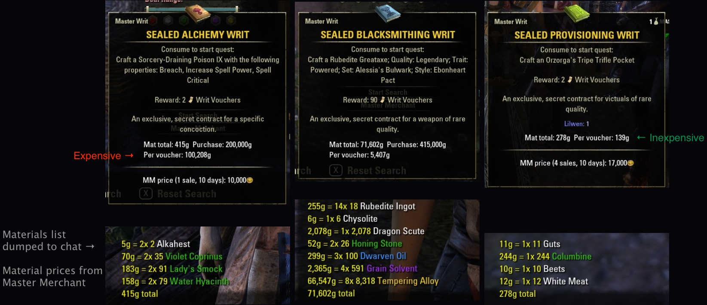
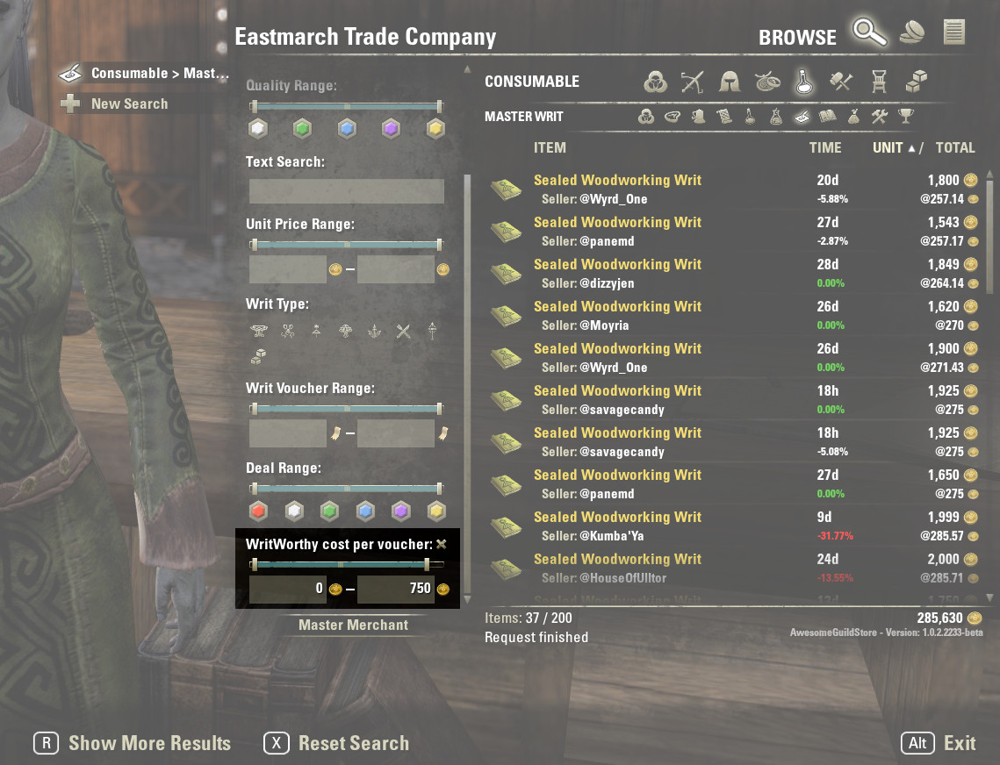
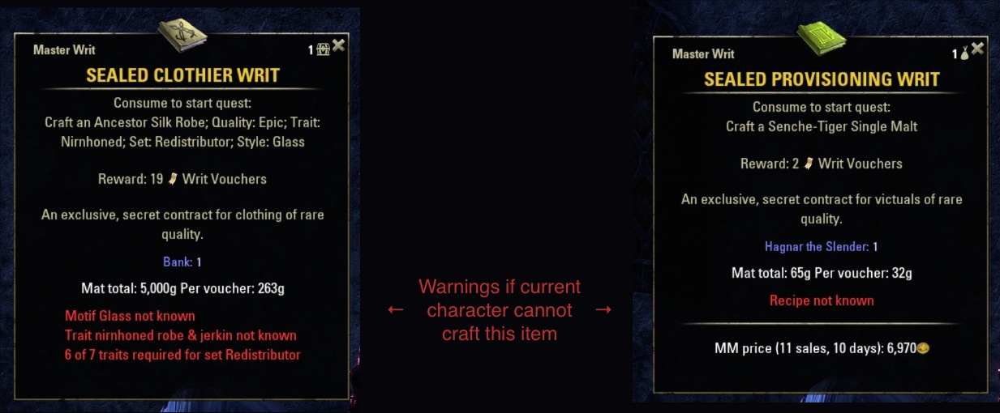
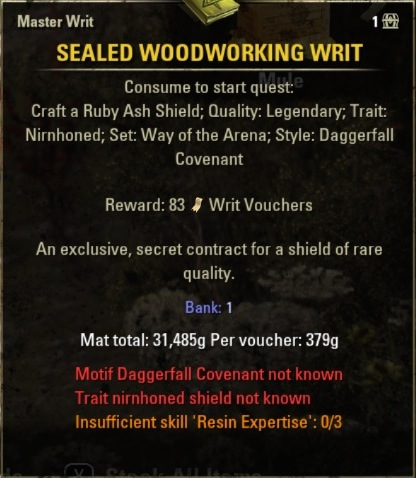
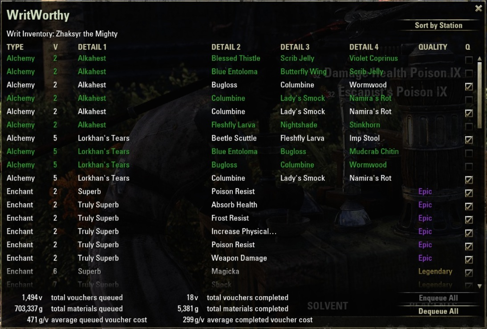
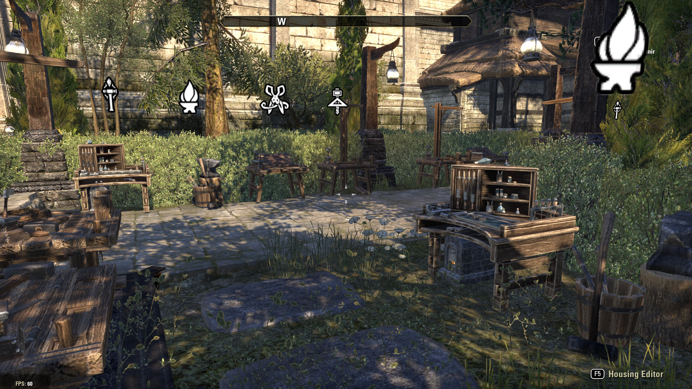

# System Requirements:

- Required, install separately: [LibLazyCrafting](https://www.esoui.com/downloads/info1594-LibLazyCrafting.html)
- Required, install separately: [LibAddonMenu-2.0](https://www.esoui.com/downloads/info7-LibAddonMenu.html)
- Required, install separately: [LibPrice](https://www.esoui.com/downloads/info2204-LibPrice.html)
- Required, install separately: [LibSets](https://www.esoui.com/downloads/info2241-LibSets.html)
- (Optional) uses any of [Master Merchant](https://www.esoui.com/downloads/info928-MasterMerchant.html), [Arkadius' Trade Tools](https://www.esoui.com/downloads/info1752-ArkadiusTradeTools.html), [Tamriel Trade Centre](https://www.esoui.com/downloads/info1245-TamrielTradeCentre.html) for material price data.
- (Optional) [HomeStationMarker](https://www.esoui.com/downloads/info2396-HomeStationMarker.html) shows markers over the crafting stations for any enqueued writs.  New and experimental as of 2019-06-04.

# Why WritWorthy?

- Is a master writ worth doing?
- Does this character have the skills to do so?
- Want to craft it automatically?

## Is this master writ worth doing?

Most writs consume less than 1000g worth of materials for each writ voucher they return.  But some consume 2000g+ materials per voucher and might not be worth doing.

Shopping guild stores for Master Writs? What is the per-voucher cost of a writ, including both materials and purchase price?

This add-on adds text to each Master Writ's tooltip, showing the total material cost, purchase price (if any), and the cost per writ voucher reward.

It also optionally dumps a complete material list to chat. Surprisingly useful when filling Alchemy writs.

### Awesome Guild Store search filter

Shopping guild stores for master writs?

WritWorthy adds a filter to [sirinsidiator's AwesomeGuildStore](https://esoui.com/downloads/info695-AwesomeGuildStore.html). Lets you filter on the WritWorthy-calculated cost per voucher, which includes both material and purchase cost.

## Does this character have the skills to do so?

Not interested in writs that you cannot craft?

This add-on shows big red warnings when writ requires a motif, trait, or recipe that the current character does not yet know.

It also shows orange warnings for missing skills that are not required, but which reduce the cost of expensive writs, such as _Resin Expertise._

(No, WritWorthy does not check inventory for required materials, or space to hold the the crafted item. I assume a master crafter can handle their own inventory management.)

## Want to craft it automatically?

1. Bind a key to "Show/Hide WritWorthy" or type `/writworthy` in chat.
2. Use that key binding to see a list of all Sealed Master Writs in the current character's inventory.
3. Check the ones you want to craft automatically next time the character visits the appropriate crafting station. Or "Enqueue All" if you want to craft them all.
4. "Sort by Station" to see which crafting stations you need to visit.
5. Walk up to a station, 'E' interact, and watch Dolgubon's LibLazyCrafter make your items.
6. **Wait patiently while the automatic crafting occurs**. If you cancel interaction while still auto-crafting, you might end up auto-crafting an item twice, wasting materials. There is no indication for "all done". Sorry.
7. Once you have crafted items for your writs, you can open them, accept their quest, and the quest will automatically advance to "Turn in".

Automatic crafting requires that the appropriate cost-reduction skills have been maxed out: Temper Expertise, Chef, Brewer, or Chemistry.

### HomeStationMarker tells you where to go

WritWorthy can use [HomeStationMarker](https://www.esoui.com/downloads/info2396-HomeStationMarker.html) to show markers over the stations that you need to visit in order to craft queued master writs.

# Thank you

- Dolgubon for LibLazyCrafting
- Baetram for DE translation

# Follow development on GitHub

[ESO-WritWorthy on GitHub](https://github.com/ziggr/ESO-WritWorthy)

--Z
